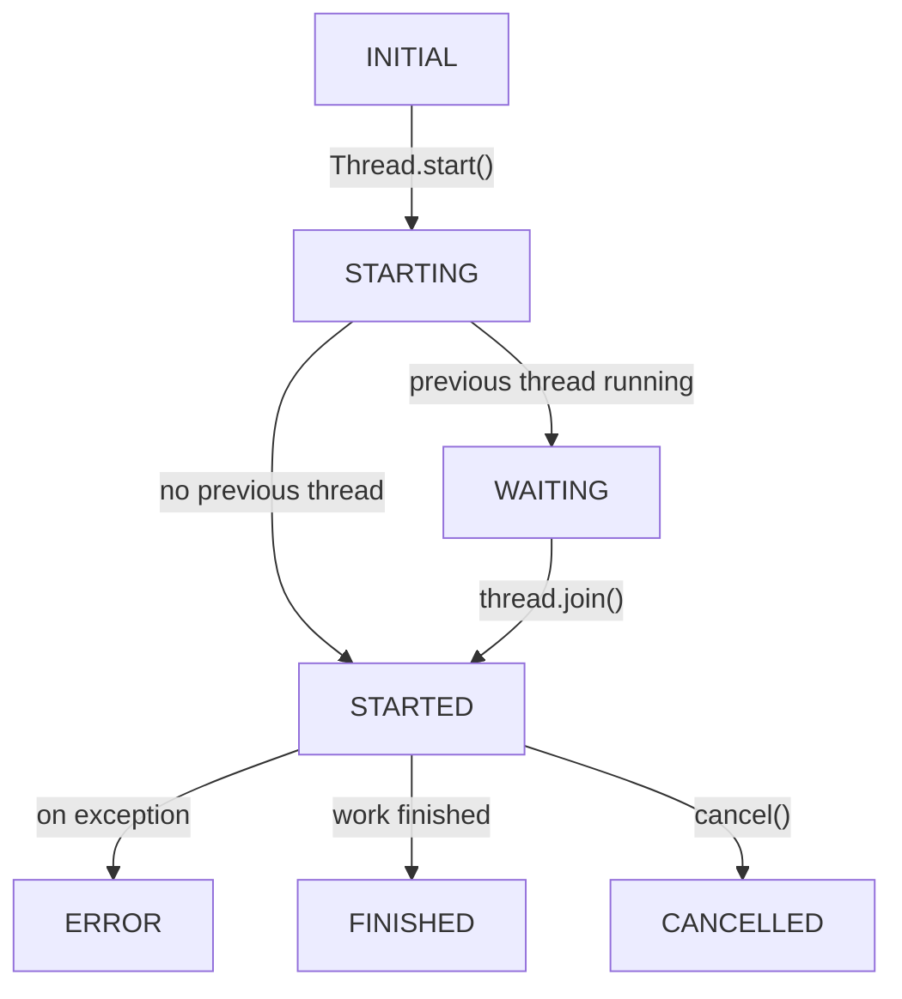

# use_thread

```python
def use_thread(
    callback=Union[
        Callable[[threading.Event], T],
        Iterator[Callable[[threading.Event], T]],
        Callable[[], T],
        Iterator[Callable[[], T]],
    ],
    dependencies=[],
) -> Result[T]:
    ...
```

`use_thread` can be used to run medium or long running jobs in a separate thread to avoid blocking the render loop.

`use_thread` takes a function as argument that takes a `threading.Event` object as argument to check whether it should stop,
and should return it's resulting value, or yield it multiple times (thus an iterator).

The return value of `use_thread` is a `Result[T]`, making it easy to have the UI reflect the state of the work beging done.

When an iterator is passed, the state only enters the `FINISHED` state after the last element is yielded. Partial, or incremental results can be detected when the state is still in `RUNNING`, but `Result[T].value` is not None.

From any state the `.cancel()` or `.retry()` may be called, which will stop the current thread, and start all over.
Note that at no time, two threads will run, since the new thread will always wait for the previous to finish.
Also note that a thread can not be cancelled, we only flag the `threading.Event` object passed to the user supplied function as set, and it is thus the responsibility of the user to check this flag regularly.

## State diagram

The possible values for Result[T].state are reflected in this state diagram.


