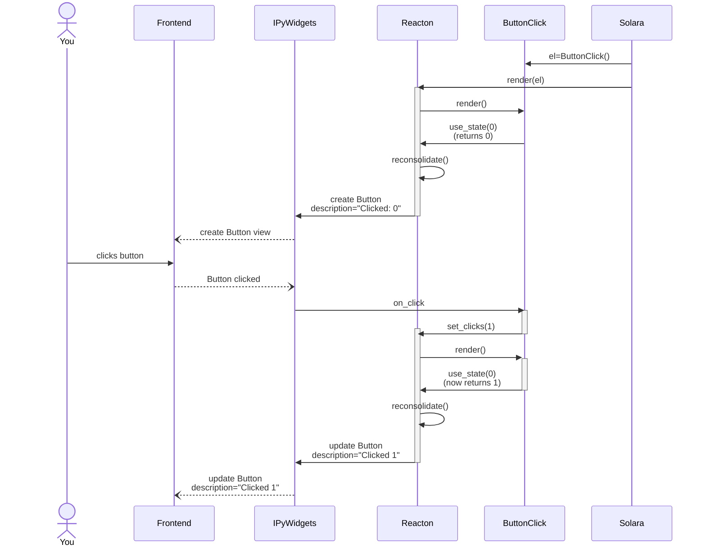

# Reacton basic understanding


Let us take our favorite component, and try to understand a bit better how it works to improve your understanding of Reacton and thus how to use Solara.


```solara
import solara


@solara.component
def ClickButton():
    clicks, set_clicks = solara.use_state(0)

    def my_click_hander():
        set_clicks(clicks + 1)

    return solara.Button(label=f"Clicked: {clicks}", on_click=my_click_hander)

Page = ClickButton
```

This example does a few things:

 * Add state (`clicks`) to the component.
 * Create a callback function (`my_click_handler`). When executed, it will increase ask Solara/Reacton to increase the `clicks` value on the next render, by calling `set_clicks`.
 * Pass the callback function to the child component (`Button`).
 * Set the `label` value on each render.

Now if a user clicks the button:

 * The `my_click_hander` callback will be called by Solara/Reacton.
 * Your code (the body of `my_click_hander`) will be executed and will ask Reacton to change the state of `clicks` by increasing the value by 1.
 * Solara/Reacton got asked to change the of `clicks`, and will execute your render function (the body of the `ClickButton` component) once.
 * Solara/Reacton will compare the return value of your component and will update the associated widget. In this case it will update the label to `"`Clicked: 1"`.

This pattern is very common, where a parent component (ClickButton) managed the state (the number of times clicked), and state changes (increasing the clicks by 1 on a button click).

## Graphically

Is the above text a bit dry? Maybe the annotated code will make it easier to understand for you.


## Going deeper


Still not satisfied? Let's go through all the steps in more detail in this sequence diagram:



In words

   1. Solara create `el = ButtonClick()` from your component.
   1. The `display(el)` triggers the call to Reacton.
   1. The render call enters the render phase, which will call the function body (which we call render function) of the `ButtonClick` component.
   1. Our ButtonClick render function calls [`use_state`](/api/use_state). Because this is our first render phase, this returns the initial value (0).
   1. The ButtonClick render function returns a Button element (not a widget!) with `description="Clicked: 0 times"`.
   1. The Reacton render call is done with the render phase, and enters the reconciliation phase, where it looks at the difference between the real widgets and the virtual widgets tree (represented by the Reacton elements). We find there is no previous widget associated with the virtual widget (or element) and decide to create a widget.
   1. Asynchronously via the Jupyter protocol, a widget model and view are created and displayed to the user in the browser.
   1. The user clicks on the button.
   1. The `on_click` handler gets triggered on the Python side, inside of the `ButtonClick` component (called `my_click_handler`).
   1. `my_click_handler` handler calls `set_clicks(1)` which triggers a re-render.
   1. The render call enters the render phase, which calls the render function of `ButtonClick` for the second time.
   1. Our ButtonClick render function calls [`reacton.use_state`](#use_state). Because this is our second render phase, this returns the last set value, which is 1.
   1. The ButtonClick render function returns a new Button element (not a widget!) with the description `"Clicked: 1 times"`.
   1. The Reacton render call is done with the render phase, and enters the reconciliation phase, where it looks at the difference between the real widgets and the virtual widgets tree (represented by the Reacton elements). We find there is a widget associated with the virtual widget (or element) and decide to update the changed attributes of the widget and set `description` to `"Clicked: 1 times"`.
   1. Asynchronously via the Jupyter protocol, the widet model and view are being updated in the browser.
