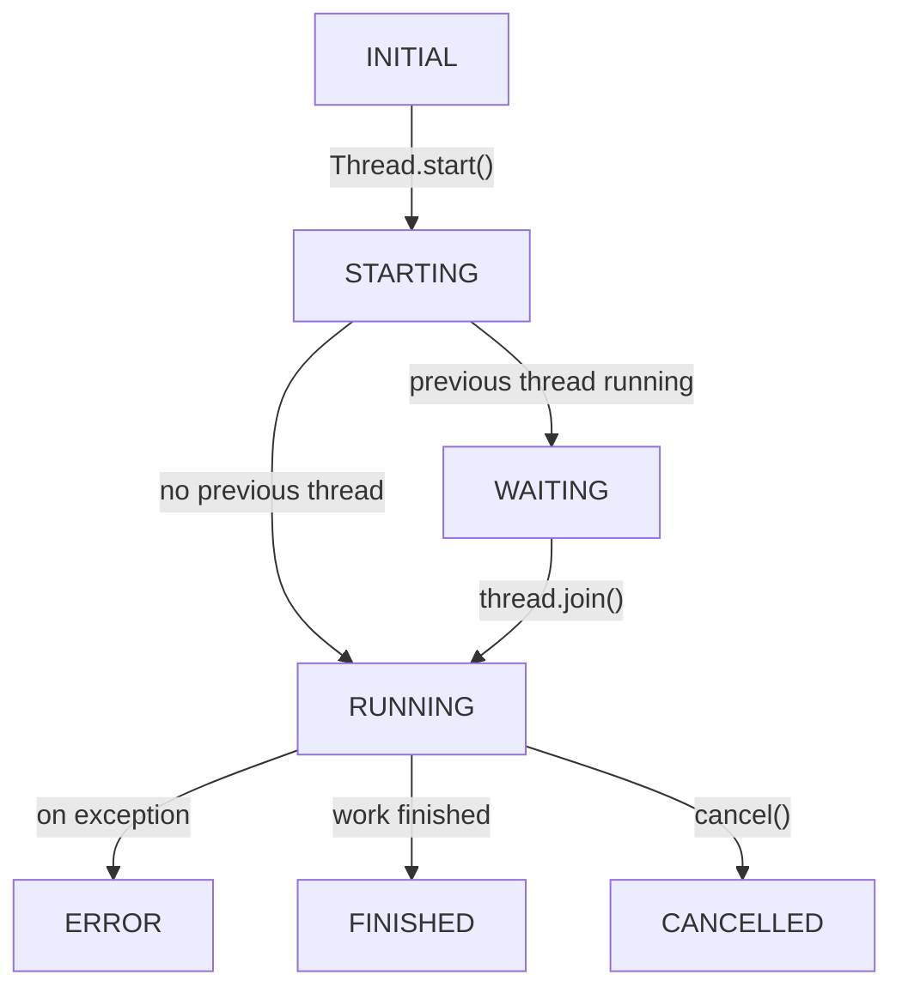

# use_thread

```python
def use_thread(
    callback=Union[
        Callable[[threading.Event], T],
        Iterator[Callable[[threading.Event], T]],
        Callable[[], T],
        Iterator[Callable[[], T]],
    ],
    intrusive_cancel=True,
    dependencies=[],
) -> Result[T]:
    ...
```

`use_thread` can be used to run medium or long running jobs in a separate thread to avoid blocking the render loop.

`use_thread` takes a function as argument that takes a `threading.Event` object as argument to check whether it should stop,
and should return it's resulting value, or yield it multiple times (thus an iterator).

The return value of `use_thread` is a `Result[T]`, making it easy to have the UI reflect the state of the work being done.

When an iterator is passed, the state only enters the `FINISHED` state after the last element is yielded. Partial, or incremental results can be detected when the state is still in `RUNNING`, but `Result[T].value` is not None.


From any state the `.cancel()` or `.retry()` may be called, which will stop the current thread, and start all over.
Note that at no time, two threads will run, since the new thread will always wait for the previous to finish.

When `intrusive_cancel=True`, a tracer is installed into the thread, which will throw a special exception to cancel the thread. This gives some runtime overhead, and a more performant way would be to set this to false and manually inspect the `threading.Event` regularly. When this is not possible (e.g. usage of an external library), this is the only way to cancel a thread while executing.


Note that `.value` and `.error` of the result object will only be set when a new result is returned. This makes is possible for a component to render the "previous" result (or previous error) while the new job is running.

## State diagram

The possible values for `Result[T].state` are stored in the dataclass `solara.ResultState`, with the possible options being

* `STARTING`
* `WAITING`
* `RUNNING`
* `ERROR`
* `FINISHED`
* `CANCELLED`

These states are reflected in the below state diagram


